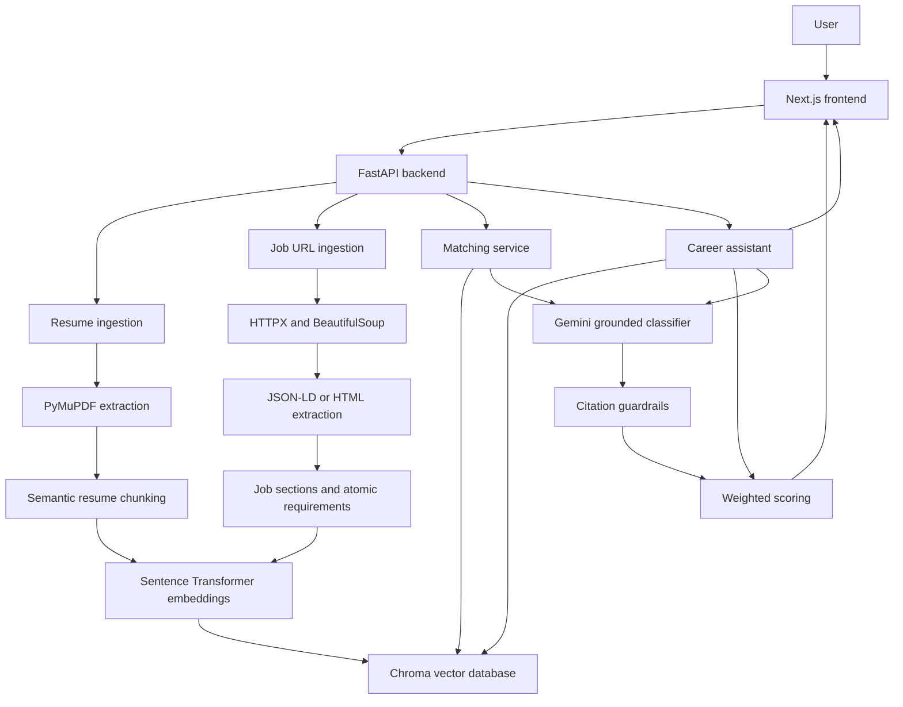
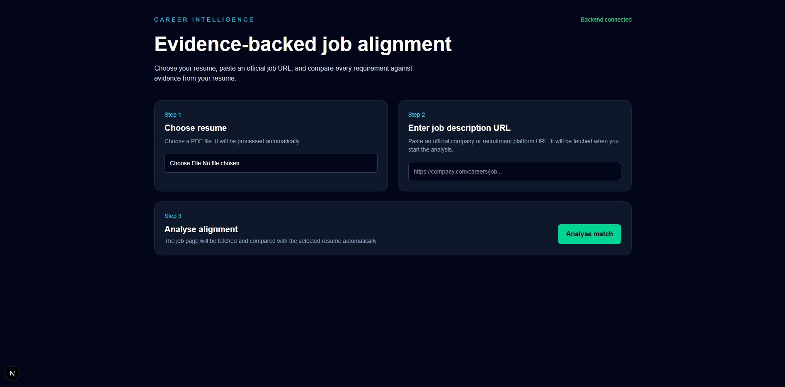
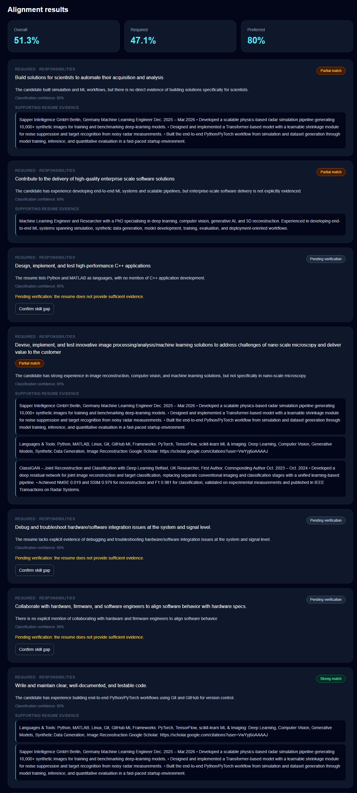
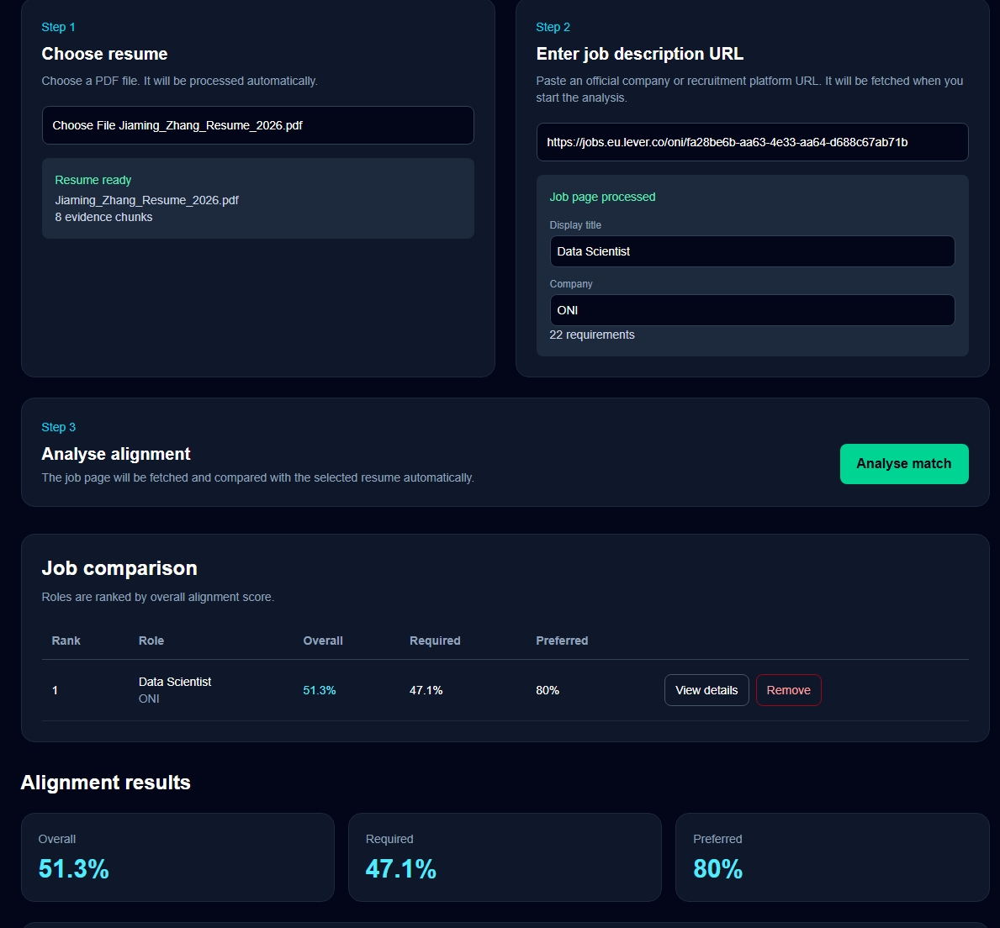
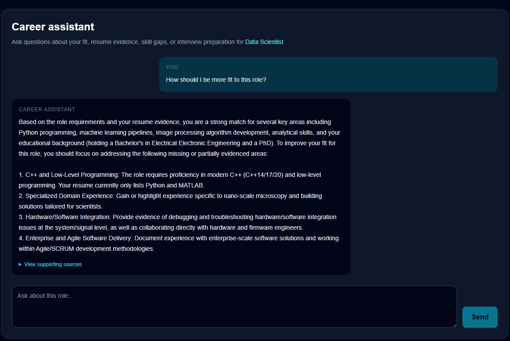

# **Career Intelligence Assistant**


This is a full-stack conversational AI application that analyses a candidate's resume against multiple job descriptions. The system retrieves evidence from the resume, evaluates individual job requirements, calculates weighted alignment scores, compares multiple roles, and supports grounded career-related questions. This project implements the \*\*Career Intelligence Assistant\*\* option of the take-home assignment.


### **I. Key Features**


* Upload and process a resume in PDF format
* Extract job descriptions from public official HTTPS job URLs
* Split resumes and job descriptions into semantic sections
* Convert resume evidence and job requirements into embeddings
* Store embeddings and metadata in a local Chroma vector database
* Retrieve relevant resume evidence for each job requirement
* Classify requirements as: strong\_match; partial\_match; not\_evidenced\_in\_resume
* Allow the user to confirm that missing evidence represents an actual skill gap
* Calculate weighted required, preferred, and overall alignment scores
* Compare and rank multiple jobs
* Ask grounded questions about fit, evidence, gaps, and interview preparation
* Validate model-generated evidence citations before displaying them
* Allow users to correct job titles and company names when website metadata is incomplete


*Note: The system distinguishes between a **resume evidence gap** and an <b>actual skill gap</b>. For example, if C programming is not mentioned in the uploaded resume, the system does not conclude that the candidate has never used C. It initially reports the requirement as "not\_evidenced\_in\_resume". However, the user may then explicitly confirm that it is an actual skill gap. This avoids turning missing document evidence into an unsupported claim about the candidate.*


### **II. Architecture**





#### **II-A. Frontend**

The frontend is built with:

* Next.js
* React
* TypeScript
* Tailwind CSS


*Note:* *It manages the resume and job workflow, comparison list, ranking display, job metadata corrections, per-job chat messages, and user-confirmed gaps.*


#### **II-B. Backend**


The backend is built with:

* FastAPI
* Pydantic
* PyMuPDF
* HTTPX
* Beautiful Soup
* Sentence Transformers
* Chroma
* Google Gemini API


*Note: The backend separates document parsing, semantic chunking, ingestion, retrieval, model classification, scoring, analysis caching, and conversational question answering.*


### **III. Processing Pipeline**

#### **III-A. Resume ingestion**


The uploaded PDF is:

1\. Validated by file type, signature, and size.

2\. Parsed with PyMuPDF.

3\. Split into semantic resume sections.

4\. Converted into evidence-oriented chunks.

5\. Embedded with `all-MiniLM-L6-v2`.

6\. Stored in Chroma with metadata including:

  1) document ID

  2) chunk ID

  3) section ID

  4) section type

  5) source text

  6) page numbers


*Note: Contact details and identity sections are not used as matching evidence. The original PDF is processed in memory and is not saved as an uploaded PDF. However, extracted resume text is stored in Chroma and must still be treated as sensitive personal data.*


#### **III-B. Job ingestion**


The user supplies an official public HTTPS job URL.


The backend:


1\. Validates that the URL resolves to a public network address.

2\. Limits redirects and downloaded HTML size.

3\. Retrieves the job page.

4\. Prefers structured `JobPosting` JSON-LD when available.

5\. Falls back to cleaned HTML extraction.

6\. Identifies semantic sections such as responsibilities, required qualifications, preferred qualifications, and technical skills.

7\. Converts matching sections into atomic requirements.

8\. Embeds and stores both job sections and individual requirements in Chroma.


*Note: Some JavaScript-rendered or anti-bot-protected job websites may not be extractable by the current implementation.*


#### **III-C. Evidence retrieval and classification**


For every job requirement, the matching service retrieves the top relevant resume chunks using cosine similarity. Retrieval similarity is used only to locate candidate evidence. It is \*\*not\*\* treated as proof that the candidate satisfies the requirement. The retrieved evidence and requirement are sent to Gemini for a grounded classification:


* "strong\_match": direct resume evidence supports the material parts of the requirement
* "partial\_match": related or incomplete evidence is present
* "not\_evidenced\_in\_resume": the supplied resume evidence is insufficient


Each result contains:


* original requirement
* requirement type and category
* retrieved evidence
* classification
* confidence
* explanation
* supporting resume chunk IDs
* guardrail status


*Note: A strong or partial match must cite at least one valid chunk retrieved for that requirement. If Gemini returns an invalid or invented chunk ID, the backend downgrades the result to “not\_evidenced\_in\_resume”.*


#### **III-D. Scoring and comparison**


The scoring policy is deterministic:


| Requirement type | Weight |

|---|---:|

| Required | 2.0 |

| Preferred | 1.0 |


| Classification | Value |

|---|---:|

| Strong match | 1.0 |

| Partial match | 0.5 |

| Not evidenced in resume | 0.0 |


The system calculates:


* overall alignment score
* required criteria score
* preferred criteria score
* classification counts
* pending verification count
* citation guardrail count


*Note: Model confidence is displayed but is not included in the score. Multiple job analyses can be compared and ranked in the frontend. A comparison can also be removed so the ranking can change. User-confirmed skill gaps are currently session-level UI state. They clarify the meaning of missing evidence but do not silently change the original model classification or weighted score.*


#### **III-E.** **Grounded conversational assistant**


The Career Assistant uses:


* the cached structured analysis
* retrieved resume chunks
* retrieved job-description chunks
* recent conversation history


The assistant is instructed to use only supplied evidence and to distinguish missing resume evidence from a confirmed skill gap. The model returns structured source IDs. The backend removes invalid citations and refuses to return an unsupported answer when no valid grounding source remains. The frontend keeps a limited per-job conversation history for the current browser session and allows users to inspect supporting sources separately.


### **IV. Repository Structure**


```text

Career\_Consultant/

├── backend/

│   ├── analysis\_cache.py

│   ├── chat\_service.py

│   ├── chunking.py

│   ├── config.py

│   ├── gemini\_classifier.py

│   ├── job\_chunking.py

│   ├── job\_ingestion.py

│   ├── job\_service.py

│   ├── main.py

│   ├── matching\_service.py

│   ├── pdf\_parser.py

│   ├── requirements.txt

│   ├── resume\_ingestion.py

│   ├── schemas.py

│   ├── scoring.py

│   ├── vector\_store.py

│   └── tests/

├── frontend/

│   ├── app/

│   ├── lib/

│   ├── package.json

│   └── package-lock.json

├── .gitignore

└── README.md

```


### **V. Quick Setup**


#### **Prerequisites**


Install:

* Git
* Python 3.12
* Node.js 20.9 or newer
* A Gemini API key


Docker and PostgreSQL are not required for the current version.


#### **V-A. Clone the repository**


```bash

git clone https://github.com/NP-Assignments-Labs/fde-jiaming-zhang-dc0872ad.git

cd fde-jiaming-zhang-dc0872ad

```


#### **V-B. Create a Python environment**


Using Conda:


```bash

conda create -n career-intel python=3.12

conda activate career-intel

```


Alternatively, using Python `venv`:


```bash

python -m venv .venv

```


Windows activation:


```bat

.venv\\Scripts\\activate

```


macOS/Linux activation:


```bash

source .venv/bin/activate

```


#### **V-C. Install backend dependencies**


```bash

cd backend

python -m pip install -r requirements.txt

```


The first installation may take some time because Sentence Transformers installs machine-learning dependencies.


#### **V-D. Configure environment variables**


Copy the example file:


Windows:


```bat

copy .env.example .env

```


macOS/Linux:


```bash

cp .env.example .env

```


Open `backend/.env` and set:


```dotenv

CAREER\_DATA\_DIR=./data

GEMINI\_API\_KEY=your-real-api-key

GEMINI\_MODEL=gemini-3.5-flash-lite

```


If the configured Gemini model is unavailable for the account, replace `GEMINI\_MODEL` with a model ID available to that Gemini API project. For sensitive local use, the data directory can be placed outside the repository. For example, on Windows:


```dotenv

CAREER\_DATA\_DIR=%LOCALAPPDATA%\\CareerIntelligence\\data

```


**Never commit the real `.env` file.**


#### **V-E. Start the backend**


From the `backend` directory:


```bash

python -m uvicorn main:app --reload --port 8000

```


Backend health check:


```text

http://127.0.0.1:8000/health

```


Interactive API documentation:


```text

http://127.0.0.1:8000/docs

```


On first use, the embedding model may be downloaded automatically.


#### **V-F. Install and start the frontend**


Open a second terminal:


```bash

cd frontend

npm ci

npm run dev

```


If PowerShell prevents `npm.ps1` from running, use:


```bat

npm.cmd ci

npm.cmd run dev

```


Open the application:


```text

http://localhost:3000

```


#### **V-G. How to Use the Application**


1\. Click **Choose resume** and select a PDF resume.

2\. Enter an official public job-description URL.

3\. If the extracted title or company is missing or incorrect, edit the displayed values.

4\. Click **Analyse match**.

5\. Review the overall, required, and preferred alignment scores.

6\. Inspect each requirement, classification, explanation, and supporting resume evidence.

7\. For a pending requirement, use **Confirm skill gap** only if it is genuinely absent from your experience.

8\. Add another job URL and run another analysis.

9\. Compare roles in the ranking section.

10\. Use **View details** to return to an individual analysis.

11\. Use **Remove** to remove a role from the comparison.

12\. Ask the Career Assistant questions such as:

&#x09;1) What skills are not evidenced in my resume?

&#x09;2) What are my strongest matches for this role?

&#x09;3) How should I prepare for this interview?

&#x09;4) Which resume evidence supports this requirement?

&#x09;5) ...


Analysis and chat requests require the backend process to remain running.


#### **V-H. Testing and Quality Checks**


Backend tests:


```bash

cd backend

python -m pytest

```


Current result:


```text

17 passed

```


The tests cover:


* analysis-cache behaviour
* API success and failure cases
* citation guardrails
* incomplete model output
* semantic job chunking
* deterministic scoring


Frontend checks:


```bash

cd frontend

npm run lint

npm run build

```


On Windows, `npm.cmd` can be used instead. The production build has been verified successfully.


### **VI. RAG and LLM Decisions**


#### **VI-A. Embedding model**


`all-MiniLM-L6-v2` was selected because it is small, fast, runs locally, and is sufficient for a lightweight semantic-retrieval prototype. Embeddings are normalised and queried with cosine distance.


#### **VI-B. Vector database**


Chroma was selected for the local version because it provides persistent vector search without requiring Docker or a separately managed database. This keeps setup simple while preserving a migration path to PostgreSQL with pgvector in production.


#### **VI-C. Language model**


Gemini is used for two bounded reasoning tasks:


1\. Evidence-grounded requirement classification

2\. Grounded conversational answers


The LLM is not responsible for scoring. Scoring remains deterministic and inspectable.


#### **VI-D. Orchestration**


I deliberately used explicit Python services instead of introducing LangChain, a multi-agent framework, or an autonomous agent loop. The workflow is known in advance and does not require unconstrained tool selection. Plain functions make the retrieval, validation, scoring, and failure paths easier to inspect and test.


### **VII.** **Prompt and context management**


The classifier receives only:


* one or more job requirements
* the top retrieved resume evidence for each requirement
* explicit classification and citation rules


The conversational assistant receives:


* cached structured analysis
* relevant resume and job chunks
* up to eight recent chat messages
* source identifiers available for citation


The entire resume and job description are not blindly sent to the model for every question.


### **VIII. Guardrails**


Implemented guardrails include:


* PDF signature and size validation
* public HTTPS-only job URLs
* rejection of local and private network targets
* redirect and HTML-size limits
* prompt-injection instructions treating documents as untrusted data
* no invention of candidate experience
* explicit distinction between missing evidence and missing skill
* supporting chunk validation
* refusal to return an answer without valid grounding
* API keys stored outside source control
* local runtime data excluded from Git
* confidence excluded from deterministic scoring


These controls reduce risk but do not make the system suitable for automated hiring decisions.


### **IX. Engineering Decisions**


Standards followed:


* separation between parsing, ingestion, retrieval, reasoning, scoring, and API layers
* typed request and response validation with Pydantic
* deterministic scoring logic
* environment-based secret configuration
* configurable private-data directory
* dependency version pinning
* automated backend tests
* frontend lint and production-build checks
* Git history and secret scanning before publication
* hidden internal/debug endpoints in generated API documentation


Standards intentionally deferred:


* containerisation
* continuous integration
* authentication and multi-user isolation
* database migrations
* persistent analysis and chat storage
* browser end-to-end tests
* structured production logging and tracing
* cloud secret management
* rate limiting and retry queues


The local version prioritises a working, inspectable implementation over additional infrastructure.


### **X. Privacy and Data Handling**


The uploaded PDF itself is not saved as a file by the backend. Extracted resume text, job-description text, metadata, and embeddings are stored in the configured Chroma directory. This data may contain personal information and should be treated as sensitive. The application sends retrieved evidence snippets and job requirements to the configured Gemini API when performing classification and chat operations. The following are excluded from Git:


* `.env`
* `data/`
* `uploads/`
* IDE configuration
* frontend dependencies
* build output


The current prototype has no authentication or multi-user separation and should be used as a local single-user application.


### **XI. Productionisation**


To productionise this system on AWS, GCP, Azure, or another hyperscaler, I would make the following changes.


1. Application deployment:
* Containerise the FastAPI and Next.js applications.
* Run the backend on a managed container platform such as Cloud Run, ECS/Fargate, GKE, AKS, or Azure Container Apps.
* Deploy the frontend through a CDN-backed platform.
* Add separate development, staging, and production environments.


2\. Persistent storage:

* Store encrypted uploads in managed object storage.
* Replace local Chroma with PostgreSQL and pgvector or a managed vector-search service.
* Persist users, jobs, analyses, confirmations, and chat sessions.
* Implement retention periods and user-requested deletion.


3\. Security:

* Add authentication, authorisation, and tenant isolation.
* Store API keys in a managed secrets service.
* Encrypt data in transit and at rest.
* Add malware scanning for uploaded files.
* Add stronger SSRF protection, egress controls, and domain policies.
* Add request limits, quotas, abuse detection, and audit logs.
* Obtain explicit consent for sending resume evidence to an external LLM.


4\. Reliability and scalability

* Move ingestion and model calls to background workers.
* Add retries with backoff for rate-limited model requests.
* Make API services stateless.
* Use a shared cache or database instead of process memory.
* Add idempotency controls to prevent duplicate ingestion.
* Add health, readiness, and dependency checks.


5\. Observability

I would collect:

* request latency and error rate
* job extraction success rate
* number and size of generated chunks
* retrieval-distance distributions
* model latency, token usage, cost, and quota failures
* classification distribution
* invalid citation and guardrail rates
* analysis and chat failure rates


Logs must avoid recording raw resume content or API keys. Distributed tracing would connect ingestion, retrieval, model calls, and scoring without exposing sensitive payloads.


6\. Quality evaluation


A production evaluation set should contain labelled resume–requirement pairs across different occupations and resume formats. I would measure: section-detection accuracy, requirement extraction precision and recall, retrieval recall at K, classification accuracy, citation validity, grounded-answer quality, false strong-match rate, consistency across repeated model calls. **Note that Human review would remain necessary for ambiguous evidence**.


### **XII. Limitations**


1. Resume input currently supports text-based PDFs only.

2\. Scanned PDFs are not processed with OCR.

3\. Job extraction depends on publicly accessible HTML or JSON-LD.

4\. JavaScript-rendered and anti-bot-protected pages may fail.

5\. Heading recognition is heuristic and may misclassify unusual job layouts.

6\. Gemini availability and free-tier quotas depend on the user's API project.

7\. Analysis caching is in memory and is lost when the backend restarts.

8\. Comparison, corrected job metadata, confirmed gaps, and chat state are limited to the current frontend session.

9\. The system does not authenticate users or isolate multiple users.

10\. Scores represent evidence alignment, not candidate suitability or hiring probability.

11\. The current implementation uses one embedding model and has not been calibrated against a labelled recruitment dataset.


### **XIII. AI-Assisted Development**


This project was developed with AI assistance, primarily using Codex as a coding partner. I was responsible for defining the product direction, reviewing generated code, checking whether each change matched the intended architecture, running tests, validating outputs, and deciding which suggestions to accept, modify, or reject. Because I did not have a third person continuously challenging the design, I also used ChatGPT as a critical reviewer. I first proposed my own workflow and system outline, then used ChatGPT to identify missing assumptions, question weak decisions, and highlight edge cases. Examples included distinguishing resume evidence gaps from actual skill gaps, validating model citations, handling job-extraction failures, considering private local data, and avoiding unnecessary infrastructure.


AI assistance was also used for test suggestions, refactoring discussions, and documentation structure. I did not treat generated output as automatically correct. Changes were reviewed against the source code and verified through backend tests, frontend linting, production builds, manual API calls, and application testing. I deliberately deferred some AI-suggested extensions, including broad multi-model support, because they increased complexity without improving the reliability of the core assignment workflow.


### **XIV. Future Optimization**


* Build a labelled evaluation dataset before refining prompts further.
* Add OCR support for scanned resumes.
* Add tested adapters for major job-platform formats.
* Add a browser-based fallback for JavaScript-rendered job pages.
* Persist analyses, confirmations, rankings, and conversations.
* Add user authentication and encrypted multi-tenant storage.
* Add optional local-model and multiple-provider support.
* Add Playwright end-to-end tests.
* Add CI checks for tests, linting, builds, and secret scanning.
* Add structured observability and LLM cost tracking.
* Conduct accessibility and responsive-design testing.
* Deploy a production demonstration environment.


### **Screenshots**


**Resume and job input**





**Alignment analysis**





**Job comparison**





**Conversational Assistant**


